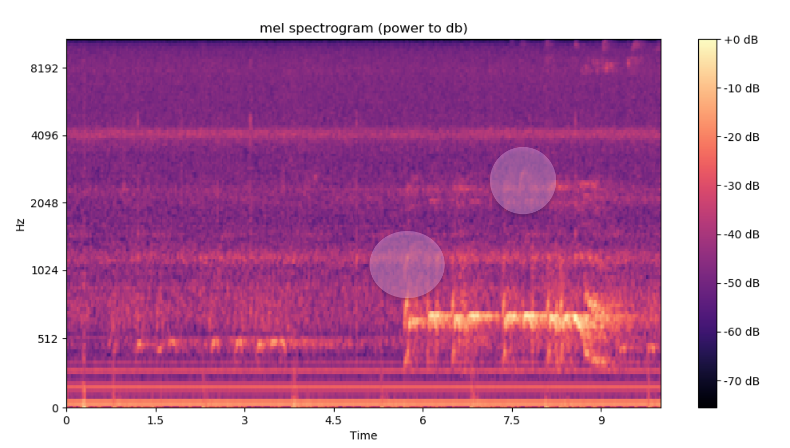

# Bird Chirp Detector

This project is an audio based anomaly detector that uses deep learning to determine whether or not a bird chriped in a given audio file. The data consists of 20K raw audio files sourced from the BirdVox project(collaboration between Cornell and NYU). Each file is a simple 10 second audio clip recocrded by remote audio monitoring devices placed throughout a forest near Ithaca, NY. 

## Pipeline Overview

At face value, this is an audio recognition project. However, I chose to pose it as an image recognition problem by first converting each raw audio file into a 2-D image called a Spectrogram via a Fast Fourier Transform (FFT). Once converted, the image gets further processed before ultimetly getting passed through a Convolutional Nenural Net (CNN) which classifies each audio clip as 'Bird' or 'No Bird'. 

While Spectrograms are 2-D image representations of sound, they actually contain 3 dimensions of information. The first 2 dimensions are the X and Y axies. The X-Axis represents time, the Y-Axis represents descrete frequencies found in the audio source file. The 3rd dimension is encoded as intensity of color and represents the amplitude/power of the signal at a given frequency. 

The audio to image conversion itself is done using the LibROSA python package which, in general, is really good for music and audio analysis.   

Spectrograms are by default generated as color images which means the have 3 channels (RGB). In the interest of keeping things light and fast, I chose to first convert each image to Gre-Scale (only 1 channel) and then to downsize each image. 

**Here's a quick overview of the overall pipeline**:
* convert audio to Spectrogram 
* convert Spectrogram to Gre-Scale
* downsize PNG 
* feed final PNG into CNN

## Example Spectrogram

Here's a sneak peak of what an actual Spectrogram of an an audio file that contains a bird chirp looks like. If you squit especially hard at the 2 circles in the image, you'll see slight hook shaped patterns which represent slight time varying signals. That's a bird chirp!

## Model

The CNN was designed using Keras with a Tensor Flow backend. All data was stored on an Amazon S3 bucket and the model was trained from scratch using a EC2 GPU instance (Tesla K80 GPU). 

**Here's a quick look at the model architecture**:
* 4 layers of convolution with 3x3 kernels
* each convolutional layer is followed by a 2x2 max pooling layer
* adam optimizer
* trained over 50 epochs 
* final 256 neuron deep artifical layer followed by a sigmoid output layer 
* dropout of 20% to avoid overfitting

## Results

The data was almost a perfect 50/50 split between 'Bird' and 'Not Bird' cases which was really nice. I was ultimetly able to get ~76% accuracy on a 5% holdout set that the CNN had never seen before.

## Future Work
There's always more to do!

I'd love to go back and try other feature extractors from LibROSA to see if its possible to tease out more signal. I'd also like to see if there would be any way to pre-process the audio itself to try and filter out certain bands of noice. On the neural net side, there's always more hyper-parameter tuning to do.

